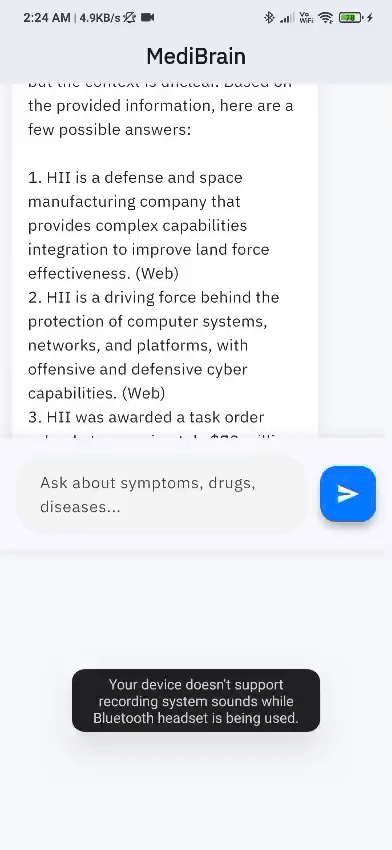

# MediBrain – AI Medical Assistant

A clean and smooth Flutter app that lets you ask medical questions and get accurate, cited answers powered by my own custom AI backend.

## Preview

  


## What This App Does

- You type any medical question (symptoms, medicine, disease, etc.)
- My self-made Python + Flask backend searches:
  - A medical PDF I converted into a vector database (Pinecone)
  - Real-time web search (Tavily)
  - Uses Groq's Llama-3.1 model to give accurate answers
- Shows answer with animations and loading effects
- Checks if answer is verified from sources

## Tech Used

**Frontend – Flutter**
- Provider for state management
- Lottie, flutter_animate, shimmer for beautiful animations
- Clean folder structure

**Backend – Python (Flask) – Made by me**
- Pinecone vector search
- Multi-query retrieval + reranking
- Web search + verification layer
- Running locally on port 8080

## How to Run (Very Easy)

```bash
# 1. Clone
git clone https://github.com/your-username/medi-brain.git
cd medi-brain

# 2. Install packages
flutter pub get

# 3. Start your backend first (python rag_server.py or use deployed URL)

# 4. Run app
flutter run

```

## Change URL in one place only:
lib/core/constants.dart → update BASE_URL
- Note
This is a personal project I built to learn full-stack AI apps.
I took help from ChatGPT and Grok to:

## Fix bugs
- Improve animations
- Structure code better
- Learn advanced RAG concepts

- But the entire logic, design, architecture, and code is written and understood by me.
# Made by
- saurav negi
- Flutter + Python Developer
- Open to opportunities
- Looking for Flutter / Full-Stack / AI-ML roles
- Email: saurav.negi1301@gmail.com | Phone: +91 XXXXXXXXXX

## Thank you for checking out my project!
### Folder setup (do this now):
```bash
your-project/
├── images/
│   ├── splash.gif
│   └── chat.gif
├── lib/
├── README.md